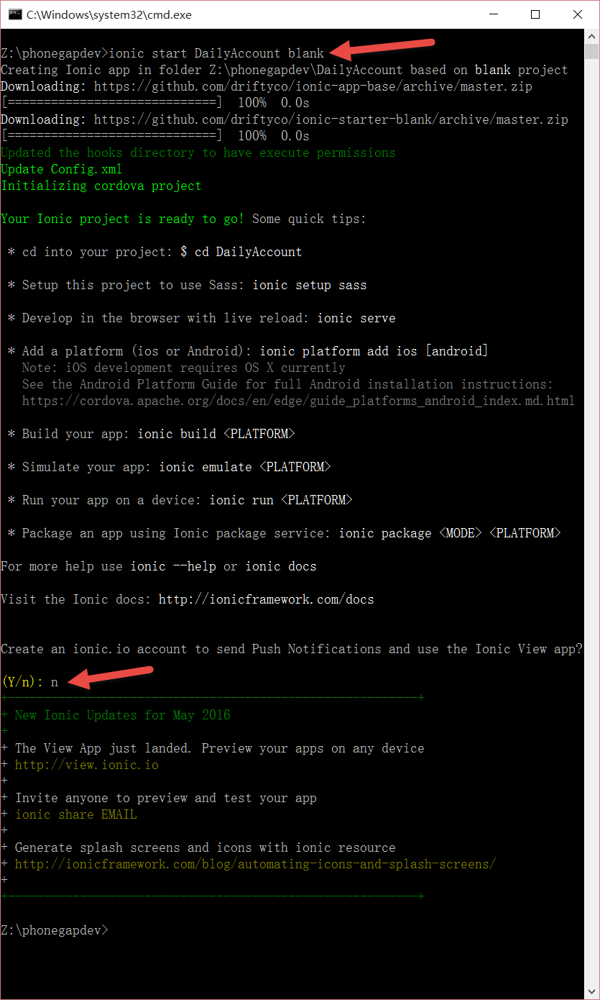
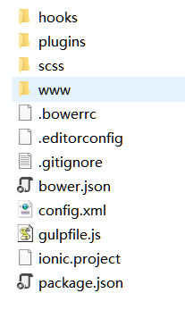

# 创建项目 

1. 创建项目
 > ionic start DailyAccount blank

 

 这样就创建好了一个名为DailyAccount的空项目。在项目目录下，ionic为我们创建好了目录结构。

 

```
├── bower.json     // bower依赖文件  
├── config.xml     // cordova配置  
├── gulpfile.js    // gulp tasks   
├── hooks          // 用来执行特定命令的自定义cordova hooks  
├── ionic.project  // ionic配置  
├── package.json   // node依赖文件  
├── platforms      // iOS/Android specific builds will reside here   
├── plugins        // cordova/ionic的插件将安装在这个目录下  
├── scss           // scss代码，将输出到www/css/  
└── www            // 应用程序，包括JS代码、库、CSS、图片等。
```

1. 添加android平台

 > cd DailyAccount
 > ionic platform add android

 > 提示：如果出现`Error: %s Error: ENOENT: no such file or directory, scandir 'C:\phonegapdev\hooks'`这样的提示，说明你忘记了cd到项目文件夹下再执行platform add命令。

1. 打包成apk
 > ionic build android

 第一次执行此命令时，会下载必要的文件，如gradle等，时间会很长，而且可能需要fq。

1. 在模拟器中运行
 > ionic emulate android

1. 真机运行
 > ionic run android

1. 浏览器中演示

 > ionic serve
