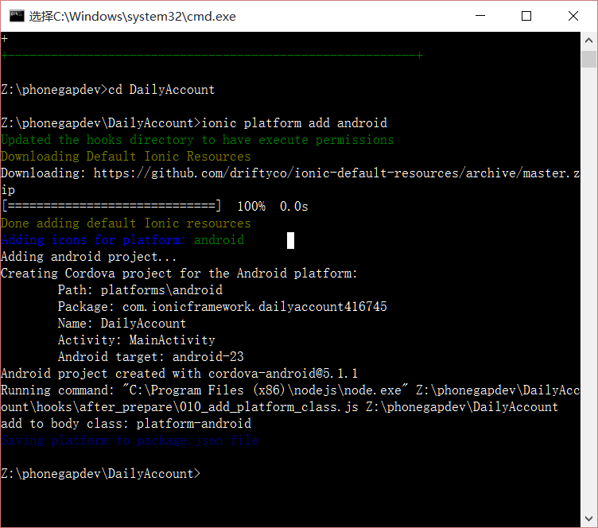
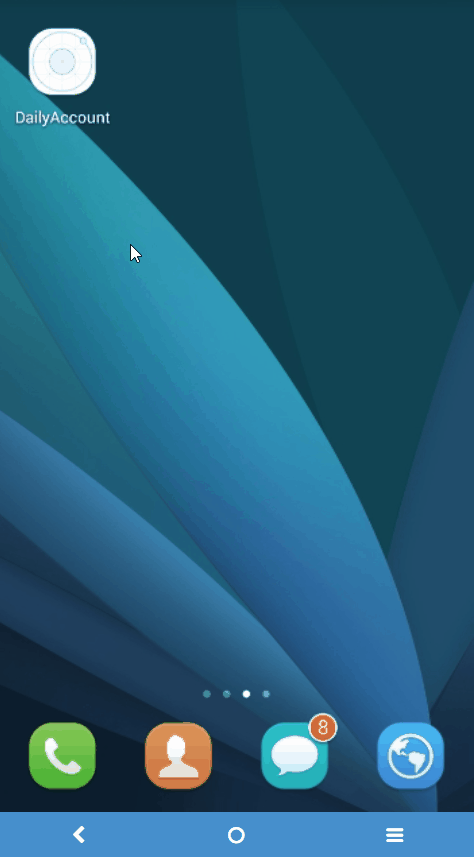

# 创建项目 

1. 创建项目
 > ionic start DailyAccount blank

 

 这样就创建好了一个名为DailyAccount的空项目。在项目目录下，ionic为我们创建好了目录结构。

 

```
├── bower.json     // bower依赖文件  
├── config.xml     // cordova配置  
├── gulpfile.js    // gulp tasks   
├── hooks          // 用来执行特定命令的自定义cordova hooks  
├── ionic.project  // ionic配置  
├── package.json   // node依赖文件  
├── platforms      // iOS/Android specific builds will reside here   
├── plugins        // cordova/ionic的插件将安装在这个目录下  
├── scss           // scss代码，将输出到www/css/  
└── www            // 应用程序，包括JS代码、库、CSS、图片等。
```

1. 添加android平台

```
 cd DailyAccount
 ionic platform add android
```

 

 > 提示：如果出现`Error: %s Error: ENOENT: no such file or directory, scandir 'C:\phonegapdev\hooks'`这样的提示，说明你忘记了cd到项目文件夹下再执行platform add命令。

1. 打包成apk

```
 ionic build android
```
 第一次执行此命令时，会下载必要的文件，如gradle等，时间会很长，而且可能需要fq。

```

Z:\phonegapdev\DailyAccount>ionic build android
Running command: "C:\Program Files (x86)\nodejs\node.exe" Z:\phonegapdev\DailyAccount\hooks\after_prepare\010_add_platform_class.js Z:\phonegapdev\DailyAccount
add to body class: platform-android
ANDROID_HOME=D:\AndroidStudio\sdk
JAVA_HOME=C:\Program Files\Java\jdk1.8.0_65
:preBuild UP-TO-DATE
:preDebugBuild UP-TO-DATE
:checkDebugManifest
:CordovaLib:preBuild UP-TO-DATE
:CordovaLib:preDebugBuild UP-TO-DATE
:CordovaLib:compileDebugNdk UP-TO-DATE
:CordovaLib:compileLint
:CordovaLib:copyDebugLint UP-TO-DATE
:CordovaLib:mergeDebugProguardFiles
:CordovaLib:packageDebugRenderscript UP-TO-DATE
:CordovaLib:checkDebugManifest
:CordovaLib:prepareDebugDependencies
:CordovaLib:compileDebugRenderscript
:CordovaLib:generateDebugResValues
:CordovaLib:generateDebugResources
:CordovaLib:packageDebugResources
:CordovaLib:compileDebugAidl
:CordovaLib:generateDebugBuildConfig
:CordovaLib:generateDebugAssets UP-TO-DATE
:CordovaLib:mergeDebugAssets
:CordovaLib:processDebugManifest
:CordovaLib:processDebugResources
:CordovaLib:generateDebugSources
:CordovaLib:compileDebugJavaWithJavacע: ijЩ�����ļ�ʹ�û�����ѹ�ʱ�� API��
ע: �й���ϸ��Ϣ, ��ʹ�� -Xlint:deprecation ���±��롣

:CordovaLib:processDebugJavaRes UP-TO-DATE
:CordovaLib:transformResourcesWithMergeJavaResForDebug
:CordovaLib:transformClassesAndResourcesWithSyncLibJarsForDebug
:CordovaLib:mergeDebugJniLibFolders
:CordovaLib:transformNative_libsWithMergeJniLibsForDebug
:CordovaLib:transformNative_libsWithSyncJniLibsForDebug
:CordovaLib:bundleDebug
:prepareAndroidCordovaLibUnspecifiedDebugLibrary
:prepareDebugDependencies
:compileDebugAidl
:compileDebugRenderscript
:generateDebugBuildConfig
:generateDebugAssets UP-TO-DATE
:mergeDebugAssets
:generateDebugResValues
:generateDebugResources
:mergeDebugResources
:processDebugManifest
:processDebugResources
:generateDebugSources
:compileDebugJavaWithJavac
:compileDebugNdk UP-TO-DATE
:compileDebugSources
:transformClassesWithDexForDebug
:mergeDebugJniLibFolders
:transformNative_libsWithMergeJniLibsForDebug
:processDebugJavaRes UP-TO-DATE
:transformResourcesWithMergeJavaResForDebug
:validateDebugSigning
:packageDebug
:zipalignDebug
:assembleDebug
:cdvBuildDebug

BUILD SUCCESSFUL

Total time: 20.051 secs
Built the following apk(s):
        Z:/phonegapdev/DailyAccount/platforms/android/build/outputs/apk/android-debug.apk
```


1. 在模拟器中运行

 ```
 ionic emulate android
 ```

1. 真机运行

 ```
 ionic run android
 ```

 

1. 浏览器中演示

 ```
 ionic serve
 ```