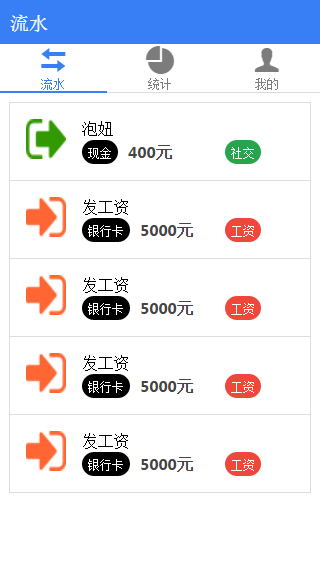

# APP开发实战第三天

## 目标
   - 首页中的流水Tab页部分。

  由于http请求遇到的坑比较多，未能完成首页的开发。今天完成首页的开发。

## 涉及到的知识点
   - Tab页的使用。
   - 列表框的使用。

## 登录页面  
### 编码  
 继续昨天，完成昨天未完成的部分。用户登录后，会回token，我们需要将用户名和token保存起来，每次请求时使用。下次再登录时，将用户名从本地读取出来，显示在登录页。
 
 1. 保存用户信息
    我们在已有的AppConfig factory中保存用户，增加userName和token字段：
    ```
      return {
        firstRun: true,
        userName: '',
        token: '',
      };

    ```
  
    在LoginCtrl中，引入AppConfig:
      ```
      .controller('LoginCtrl', ['$scope', '$rootScope', '$state','$stateParams','$ionicHistory', '$http', 'AppConfig',
        'AppConst',
        function($scope, $rootScope, $state,$stateParams,$ionicHistory,$http,AppConfig, AppConst) {

      ```
  
    $scope.login函数中，保存用户信息。
      ```
      $http.post($scope.url, $scope.loginData, $scope.config)
                .success(function (response) {
                  if (response.code != AppConst.CODE_OK){
                    $rootScope.showAlert(response.message);
                  }
                  else{
                    // 将用户名保存起来，下次登录显示。
                    if (response.data.name){
                      $rootScope.appConfig.userName = response.data.name;
                      $rootScope.appConfig.token = response.data.token;
                      AppConfig.saveConfig($rootScope.appConfig);
                    }
                  }
                })
      ```

    读取用户信息，设置给页面：
  
      ```
        // 表单数据
        $scope.loginData = {
          name: $rootScope.appConfig.userName, // 用户名
          pwd: ''   // 密码
        };
      ```
  
    在调用时，会出错：
    > Cannot read property 'userName' of undefined
    将读取$rootScope.appConfig的代码从ctrl_splash.js中移到app.js中的AppCtrl中。
      
    ```
    .controller("AppCtrl", ['$scope', '$rootScope', "AppConfig", '$state', '$ionicNavBarDelegate', '$http','$ionicPopup',
    function ($scope, $rootScope, AppConfig, $state, $ionicNavBarDelegate, $http,$ionicPopup) {
    $rootScope.appConfig = AppConfig.getConfig();
    ...
    ```
        
 1. 表单重置时，error信息不会重置。
  在通过将model数据重置，表单中的元素会自动重置，但是表单的error提示不会重置。怎么样才能像页面初次进入时的样子呢？
  网上也有相同的提问：
  http://stackoverflow.com/questions/26015010/angularjs-form-reset-error
  
  ```
    // reset dirty state
    $scope.loginForm.$setPristine();
    // reset to clear validation
    $scope.loginForm.$setValidity();
    $scope.loginForm.$setUntouched();
  ```  
  
  网上查到，在angular中，表单是FormController的一个实例。表单实例可以随意地使用name属性暴露到scope中。但我却找不到$scope.xxxForm的定义。网上也有同样的疑问：
  http://stackoverflow.com/questions/22436501/simple-angularjs-form-is-undefined-in-scope
  从网上没找到比较好的解决方法，我的方法是：在表单提交函数中传入form名：
  
  ```
  $scope.login = function (loginForm){
    loginForm是有效值，可对其进行操作。
  ...}
  
  ```
  

## Home页面
 
 Home页面是一个Tab页，由三部分组成，Header、Content和Tab Bar。Tab Bar有三个Tab图标，分别为流水、统计和我的，点击时进入相面的Tab页。

### 功能分析

  - 默认选中流水Tab页。
  - 进入此页后，清除历史记录，不可再回退。
  - 点击TabItem，可以切换Tab页。

### 编码
 1. 在page文件夹下创建home.html，代码如下：
    ```
    <ion-tabs ng-controller="HomeCtrl" class="tabs-icon-top tabs-color-active-positive">
    
      <ion-tab title="流水" icon="ion-arrow-swap" href="#/home/flow">
        <ion-nav-view name="home-flow"></ion-nav-view>
      </ion-tab>
    
      <ion-tab title="统计" icon="ion-pie-graph" href="#/home/stat">
        <ion-nav-view name="home-stat"></ion-nav-view>
      </ion-tab>
    
      <ion-tab title="我的" icon="ion-person" href="#/home/mine">
        <ion-nav-view name="home-mine"></ion-nav-view>
      </ion-tab>
    </ion-tabs>
    ```
 1. 在page文件夹下，创建home-flow.html、home-stat.html和home-mine.html，
  内容先分别写入"flow"、"stat"、"mine"即可。
  
 1. 在app.js的config中，加入home页面：
    ```
    .state("home", {
      'url' : '/home',
      templateUrl: "./page/home.html",
      abstract: true,
      // 这里定义进入此页后是否将前面的页面清掉，清掉后按回退键就不能进入前一页了。
      params: {'clearHistory': false}
    })
    .state('home.flow', {
      // **坑**：这里不能写成`/home/flow`，因为继承关系，会自动转换为`/home/flow`。
      url: '/flow',
      views: {
        'home-flow': {
          templateUrl: './page/home-flow.html',
          controller: 'HomeFlowCtrl'
        }
      }
    })
    .state('home.stat', {
      url: '/stat',
      views: {
        'home-stat': {
          templateUrl: './page/home-stat.html',
          controller: 'HomeStatCtrl'
        }
      }
    })
    .state('home.mine', {
      url: '/mine',
      views: {
        'home-mine': {
          templateUrl: './page/home-mine.html',
          controller: 'HomeMineCtrl'
        }
      }
    })

    ```
 1. 在js文件夹下创建相应的Controller文件：
 
    ctrl_home.js
  
    ```
    angular.module('app.homeCtrl', [])
      .controller('HomeCtrl', ["$scope", '$rootScope', "AppConfig", "$state",
                           function($scope, $rootScope, AppConfig, $state) {
      }
      ])
    ;
    ```
 
    ctrl_home_flow.js
  
    ```
    angular.module('app.homeFlowCtrl', [])
      .controller('HomeFlowCtrl', ["$scope", '$rootScope', "AppConfig", "$state",
                           function($scope, $rootScope, AppConfig, $state) {
      }
      ])
    ;
    ```
 
    ctrl_home_stat.js
  
    ```
    angular.module('app.homeStatCtrl', [])
      .controller('HomeStatCtrl', ["$scope", '$rootScope', "AppConfig", "$state",
                           function($scope, $rootScope, AppConfig, $state) {
      }
      ])
    ;
    ```
 
    ctrl_home_mine.js
  
    ```
    angular.module('app.homeMineCtrl', [])
      .controller('HomeMineCtrl', ["$scope", '$rootScope', "AppConfig", "$state",
                           function($scope, $rootScope, AppConfig, $state) {
      }
      ])
    ;
    ```
  
 1. 在app.js和index.html中引入这些js文件。

 1. 新建fact_flow.js文件，创建FlowFactory:
  
    ```
    angular.module('app.flow', [])
    .factory('FlowFact', function(){
      return {
        // 从服务器获取流水项。
        requestItems: function(http, from, count) {
          return [
            { img: 'img/ic_out.png',
              title: '泡妞',
              moneyType: '现金',
              price: '400元',
              type: '社交',
            }
            , { img: 'img/ic_in.png',
              title: '发工资',
              moneyType: '银行卡',
              price: '5000元',
              type: '工资',
            }
            , { img: 'img/ic_in.png',
              title: '发工资',
              moneyType: '银行卡',
              price: '5000元',
              type: '工资',
            }
            , { img: 'img/ic_in.png',
              title: '发工资',
              moneyType: '银行卡',
              price: '5000元',
              type: '工资',
            }
            , { img: 'img/ic_in.png',
              title: '发工资',
              moneyType: '银行卡',
              price: '5000元',
              type: '工资',
            }
          ];
        },
      }
    })
    ;

    ```
    这里先写死，以方便看效果，之后实现从http获取数据。
  
 1. 在app.js和index.html中引入此js文件。

 1. 修改home-flow.html
  
    ```
    <ion-view view-title="流水">
        <ion-content class="padding">
          <ion-list >
            <ion-item ng-repeat="item in flowItems"
                      class="item-avatar-left">
              
              <h2>{{item.title}}</h2>
              <div>
                <span class="app-left app-tag">
                  {{item.moneyType}}
                </span>
                <span class="app-item-price">{{item.price}}</span>
                <span class="app-right app-tag {{flowItemTypeMap[item.type].style}}">{{item.type}}</span>
              </div>
              <ion-option-button class="button-positive"
                                 ng-click="share(item)">
                Share
              </ion-option-button>
              <ion-option-button class="button-info"
                                 ng-click="edit(item)">
                Edit
              </ion-option-button>
              <ion-delete-button class="ion-minus-circled"
                                 ng-click="flowItems.splice($index, 1)">
              </ion-delete-button>
              <ion-reorder-button class="ion-navicon"
                                  on-reorder="reorderItem(item, $fromIndex, $toIndex)">
              </ion-reorder-button>

            </ion-item>
          </ion-list>
        </ion-content>
    </ion-view>

    ```
  
    效果如下：
    
  
 1. 在标题栏添加“记账”按钮，点击此按钮，可以进入记账页。
