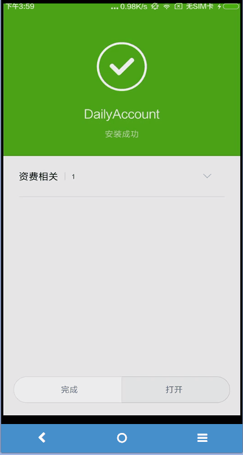
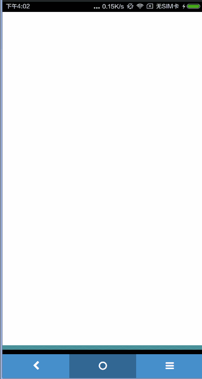

# APP开发实战第一天

## 目标
 - 实现Splash页、Wizard页、登录页。

## 涉及到的知识点

 - 如何创建一个页面。这里的页面的概念对应手机上的一屏，如启动页算一个页面，带Tab栏的页面，每个Tab页也算做一个页面。
 - 如何使用定时设置。如splash页启动3秒后自动跳转到下一页。
 - 页面之间如何跳转。
 - 如何制作图像划屏效果。像wizard页面，几个图片划动翻换图片。
 - 如何向网络提交和请求数据。
 - 如何访问本地数据。如将app配置保存到手机中，从手机中读取配置数据。

## Splash页
 
 ionic自带了splash页，但启动效果非常差，有时不显示，即使显示，也总是黑屏，体验非常不好，这里不去查其中的原因，我们使用自己的页面代替它。
 我们Splash页比较简单，由上下两个图片组成，上面是logo图片、下面是标语图片，效果如下:
  

  - 整体大小: 800 x 1280
  - 背景色: #ff6000
  - 文字色: #fff

### 功能分析

  这是APP的启动页，此页的功能如下：

  - 显示3秒后自动淡出，显示下一页。
  - 读取app配置，查看是否为第一次启动，如果是，则下一页为wizard页；否则，进入登录页（在没有home页前先这样做，之后再进行修改）。
  - 如果为第一次启动，将第一次启动信息写入本地，这样下次就不用进入wizard页了。

### 编码

  1. 在www目录下创建一个page文件夹，用于存放我们的页面。
  1. 在page页中创建一个splash.html文件。

    ```
    <!--启动页， 不显示标题栏，控制器为SplashCtrl，稍后定义-->
    <ion-view hide-nav-bar="true" ng-controller="SplashCtrl">
      <div class="app-splash-logo">
        <div class="flexbox"><div>
          <image src="img/splash/logo.png" />
        </div></div>
      </div>
      <div class="app-splash-slogan">
        <image src="img/splash/slogan.png" />
      </div>
    </ion-view>
    ```

    其样式的实现参见style.css。

  1. 将splash.html文件加到index.html中。
    
    打开app.js，对.config(function...配置如下：

    ```
    .config(function ($stateProvider, $urlRouterProvider) {
    $stateProvider
      // splash页面
      .state("splash", {
        templateUrl: "./page/splash.html"
      })
      // wizard页面（稍后定义）
      .state("wizard", {
        templateUrl: "./page/wizard.html"
      })
      // login页面（稍后定义）
      .state("login", {
        templateUrl: "./page/login.html"
      })
      ;

  }).controller("AppCtrl", function ($scope, $state, $ionicNavBarDelegate) {
    // 缺省进入splash页面。
    $state.go('splash');
  }

  ```

  1. 创建一个factory用于存取app本地数据。

    在js文件夹下，创建app_config.js文件，内容如下：  

  ```
  angular.module('app.appConfig', [])
  .factory('AppConfig', function(){
    return {
      // 获取App配置数据
      getConfig: function() {
        var appConfig = window.localStorage['appConfig'];
        if(appConfig) {
          return angular.fromJson(appConfig);
        }
        return return {
          firstRun: true
        };
      },
      // 保存App配置数据
      saveConfig: function(appConfig) {
        window.localStorage['appConfig'] = angular.toJson(appConfig);
      },
    }
  });

  ```   

  在app.js中，引入此factory：

  ```
  // angular.module('starter', ['ionic'])
  // 修改后：
  angular.module('starter', ['ionic','app.appConfig'])

  ```

  在index.html中，新增：

  ```
  /** 原有 */
  <script src="js/app.js"></script>
  /** 新增 */
  <script src="js/app_config.js"></script>

  ```

  1. 在page中增加一个wizard.html和login.html文件，内容暂写"wizard"和"login"即可。

  1. 创建Splash的Controller  
    在js中创建ctrl_splash.js文件，内容如下：
    ```
  angular.module('app.splashCtrl', [])
    .controller('SplashCtrl', ["$scope", "AppConfig", "$timeout", "$state", 
                      function($scope, AppConfig, $timeout, $state) {
      $scope.appConfig = AppConfig.getConfig();

      $scope.getFirstRun = function () {
        if (null == $scope.appConfig){
          return true;
        }

        return $scope.appConfig.firstRun;
      };

      $scope.isFirstRun = $scope.getFirstRun();

      // 将firstRun改为false，保存到本地。
      $scope.appConfig.firstRun = false;
      AppConfig.saveConfig($scope.appConfig);

      // 3秒钟后跳转到wizard页
      $timeout(function(){
        // 如果第一次运行跳转至wizard页，否则跳转至login页。
        $state.go($scope.isFirstRun ? 'wizard' : 'login');
      }, 3000);
    }
    ])
  ;

    ```

    参照上面引入app_config.js的方法，在app.js和index.html中引入。

    然后在splash.html中引入：
    ```
    <ion-view hide-nav-bar="true" ng-controller="SplashCtrl">

    ```

    至此，splash页加处理完毕。现在可以运行看一下效果。
    第一次运行：   
    

    开始的白屏暂且不管，以后进行优化处理。

    再次运行：   
    

    - 待解决问题：
     1. 出现splash前白屏且有标题栏
     1. splash与下一页切换不是淡入淡出
     1. 按下返回键splash会重新出现

     下面先解决按下返回键splash页会重新出现的问题。

  1. 禁止下一页后点击回退按钮返回此页  
   需要在下一页来处理。比如进入wizard页，则需要对Wizard页进行如下配置：
   
   ```
    .state("wizard", {
      url: "/wizard.html",
      templateUrl: "./page/wizard.html"
      // 这里定义进入此页后是否将前面的页面清掉，清掉后按回退键就不能进入前一页了。clearHistory为自定义参数。
      params: {'clearHistory': false}
    })

   ```

   进入此页时，需要如下处理：
   ```
   // 之前
   // $state.go('wizard');
   // 现在
   $state.go('wizard', {
     clearHistory: true
   });

   ```

   然后在Wizard的Controller中：  

   ```
  .controller('WizardCtrl', ["$scope", "$state",'$stateParams','$ionicHistory',
    function($scope, $state,$stateParams,$ionicHistory) {
    ...
    if ($stateParams != null && $stateParams.clearHistory){
      $ionicHistory.clearHistory();
    }
  ```
  这样，在真机运行时，按回退键就不会返回上一页了。在浏览器预览中点击回退按钮仍然会回退，不用管。


## Wizard页
 
 Wizard页比较简单，实现一个三屏的滑动图片，最后一个图片带有一个"点击进入"按钮，点击后，进入login页。
 图片滑动使用ion-slides来实现。

### 功能分析

  - 左滑显示下一张图片
  - 最后一张图片显示“点击进入”按钮。
  - 点击“点击进入”按钮，进入login页。

### 编码

 1. 修改wizard.html中的代码：

 ```
<ion-view  ng-controller="WizardCtrl" hide-nav-bar="true">
  <ion-slides options="slideOptions" slider="slideData.slider">
    <ion-slide-page>
      <div class="box app-wizardimg">
        
      </div>
    </ion-slide-page>
    <ion-slide-page>
      <div class="box app-wizardimg">
        
      </div>
    </ion-slide-page>
    <ion-slide-page>
      <div class="box app-wizardimg">
        
      </div>
      <div class="app-centerdiv app-bottom30">
        <a class="button button-positive app-btnGoHome" ui-sref="login">立即进入</a>
      </div>
    </ion-slide-page>
  </ion-slides>
</ion-view>

 ```
 1. 创建ctrl_wizard.js

 ```
angular.module('app.wizardCtrl', [])
  .controller('WizardCtrl', ["$scope", "$state", function($scope, $state) {
    $scope.slideOptions = {
      loop: false,
      speed: 500
    }

    $scope.slideData = {};
    $scope.$watch('slideData.slider', function(nv, ov) {
      $scope.slider = $scope.slideData.slider;
    });
  }
  ])
;

 ``` 

 将ctrl_wizard.js引入到app.js和index.html中。


## 登录页面

接下来处理登录页面。通过输入用户名和密码来登录。
 - 用户名：2-20位字符，允许汉字，名称唯一。
 - 密码：6至20位字母和数字组合，区分大小写。

### 功能描述

 - 点击“登录”按钮，先进行本地输入检查，当不正确时，在input下方显示错误提示。
  - 用户名：不能为空；长度在2-20位字符之间。
  - 密码：不能为空；长度在6-20位之间；只为能数字、小写英文字母、大写英文字母。
 - 本地验证通过后，请求http，如果用户名密码正确，跳转至home页；否则，弹出错误提示框。

 - 点击“注册”按钮，跳转至注册页。
 
### 技术点分析
 - 表单验证
 - 提示对话框使用
 - http post请求及结果分析

### 编码

 1. 修改login.html页，内容如下：
  ```
  <ion-view  ng-controller="LoginCtrl" view-title="登录">
  <ion-content>
    <!--novalidate : 不使用h5自带的验证，使用angularjs验证-->
    <form role="form" name="loginForm" ng-submit="login(loginForm.$valid)" novalidate >
      <div class="list">
        <label class="item">
          <div class="app-centerdiv">
            
          </div>
        </label>
        <label class="item item-input">
          <input type="text" placeholder="输入用户名" name="name" required ng-minlength="2" ng-maxlength="20" ng-model="loginData.userName">
        </label>
        <div class="error app-form-error"
             ng-show="loginForm.name.$dirty && loginForm.name.$invalid">
          <small class="error" ng-show="loginForm.name.$error.required">
            请填写名称
          </small>
          <small class="error" ng-show="loginForm.name.$error.minlength">
            名称不能少于2字符
          </small>
          <small class="error" ng-show="loginForm.name.$error.maxlength">
            名称不能超过20字符
          </small>
        </div>

        <label class="item item-input">
          <input type="password" placeholder="输入密码" name="pwd" required ng-minlength="6" ng-maxlength="20" check-pwd ng-model="loginData.pwd">
        </label>
        <div class="error app-form-error"
             ng-show="loginForm.pwd.$dirty && loginForm.pwd.$invalid">
          <small class="error" ng-show="loginForm.pwd.$error.required">
            请输入密码
          </small>
          <small class="error" ng-show="loginForm.pwd.$error.minlength">
            不能少于6字符
          </small>
          <small class="error" ng-show="loginForm.pwd.$error.maxlength">
            不能超过20字符
          </small>
          <small class="error" ng-show="loginForm.pwd.$error.checkPwd">
            密码只能为字母和数组的组合
          </small>
        </div>
      </div>
      <div class="padding">
        <!--禁用： ng-disabled="loginForm.$invalid"-->
        <button type="submit" class="button button-block button-positive" >登录</button>
      </div>
    </form>

  </ion-content>
  </ion-view>
  ```
  其中，
  - `LoginCtrl`稍后创建。
  - `login(loginForm.$valid)`为LoginCtrl创建的登录函数。`loginForm.$valid`为name为loginForm的验证属性，当表单数据填写正确时，`$valid`为true。只有当为true时，我们才进行http请求。
  - `<input type="text" placeholder="输入用户名" name="name" required ng-minlength="2" ng-maxlength="20" ng-model="loginData.userName">`: `required`表示此字段必填，`ng-minlength`和`ng-maxlength`表示字符长度限制，`loginData`为LoginCtrl定义的对象，用来描述http请求时的参数。这里通过`ng-model`将其对象的userName属性绑定到input控件。
  - `<div class="error app-form-error" ng-show="loginForm.name.$dirty && loginForm.name.$invalid">`...段表示当表单数据不正确时，在input下方显示的提示。
  - `<input type="password" placeholder="输入密码" name="pwd" required ng-minlength="6" ng-maxlength="20" check-pwd ng-model="loginData.pwd">`中，check-pwd是我们自定义的密码验证处理，对应的错误提示为：`<small class="error" ng-show="loginForm.pwd.$error.checkPwd">`

 1. 创建ctrl_login.js文件，内容如下：  
 ```
angular.module('app.loginCtrl', [])
  .controller('LoginCtrl', ['$scope', '$state','$stateParams','$ionicHistory','$ionicPopup',
    function($scope, $state,$stateParams,$ionicHistory,$ionicPopup) {
      if ($stateParams != null && $stateParams.clearHistory){
        $ionicHistory.clearHistory();
      }

      // 表单数据
      $scope.loginData = {
        userName: '', // 用户名
        pwd: ''       // 密码
      };

      // 错误提示框
      $scope.showAlert = function(msg) {
        var alertPopup = $ionicPopup.alert({
          title: '错误',
          template: msg
        });

        alertPopup.then(function(res) {
          // do nothing.
        });
      };

      // 登录处理。
      // 坑：当input验证不通过时，loginData中的相应字段值为null，而不是用户输入的值。
      $scope.login = function (valid) {
        console.log($scope.loginData);
        if (!valid){
          $scope.showAlert('请输入正确的参数。');
          return;
        }
      }
    }
  ])

  // 自定义密码检测指令。
  // 坑: 在js中使用驼峰命名，在html中使用-分隔符，如checkPwd在html的input中使用为：check-pwd
  .directive('checkPwd', [function () {
    return {
      require: "ngModel",
      link: function (scope, element, attr, ngModel) {
        if (ngModel) {
          // 只允许字母和数字。
          var pwdRegex = /^[A-Za-z0-9]+$/i;
        }
        var pwdValidator = function (value) {
          var validity = ngModel.$isEmpty(value) || pwdRegex.test(value);
          ngModel.$setValidity("checkPwd", validity);
          return validity ? value : undefined;
        };
        ngModel.$formatters.push(pwdValidator);
        ngModel.$parsers.push(pwdValidator);
      }
    };
  }])
;
```

 将ctrl_login.js引入到app.js和index.html中。

# APP开发实战第二天

## 目标
 - 完善登录页、实现注册页、首页中的流水Tab页部分。
 - server的搭建、数据请求接口实现。（不在此介绍）

## 涉及到的知识点

 - 如何向网络提交和请求数据。
 - Tab页的使用。
 - 列表框的使用。

## 登录页面  
### 编码  
 继续昨天，完成昨天未完成的部分。
 1. 实现http请求 
   目前为止，表单的本地验证部分处理完毕。现在实现http请求。http请求需要实现服务，其内容不在此部分介绍。
   请求接口参见：[与服务的API接口设计](./app_api.md)
    关于http请求的更多信息参见：https://docs.angularjs.org/api/ng/service/$http#post

    - 获取header数据
    每个请求接口都需要传递header数据，我们在AppConfig中来设置要传递的header数据。

    - 发送请求：
    在$scope.login函数中，增加：

    ```
    $scope.login = function (valid) {
      console.log($scope.loginData);
      if (!valid) {
        $rootScope.showAlert('请输入正确的参数。');
        return;
      }

      $scope.config = {headers: $rootScope.httpHeaders};
      $scope.url = AppConst.URL + AppConst.LOGIN;
      $http.post($scope.url, $scope.loginData, $scope.config)
        .success(function (response) {
          if (response.code != AppConst.CODE_OK){
            $rootScope.showAlert(response.message);
          }
        })
        .error(function (data) {
          //错误代码
          $rootScope.showAlert(data);
        });
    }

    ```

    在浏览器中预览时，会出现跨域请求错误，在app安装到手机上后，此问题不存在。下面说明如何解决这个问题。

 1. 解决跨域请求的问题  

  参考http://ionichina.com/topic/54f051698cbbaa7a56a49f98  

   1. ionic.project修改：  

      ```
      {
        "name": "DailyAccount",
        "app_id": "",
        "proxies": [
          {
            "path": "/admin/if/",
            "proxyUrl": "http://mmb.qsc365.com/admin/if/"
          }
        ]
      }

      ```
     其中，proxies为增加的内容。

   1. 在app.js中，对`angular.module('starter', ['ionic','app.appConfig','app.splashCtrl','app.wizardCtrl','app.loginCtrl'])`增加：  
     ```
     angular.module('starter', ['ionic','app.appConfig','app.splashCtrl','app.wizardCtrl','app.loginCtrl'])
    .constant('ApiEndpoint', {
      url: 'http://localhost:8100/admin/if/'
    })
    ```
      **提示**：当以`ionic serve`在浏览器中启动时，占用的端口号为8100
       
   1. 安装replace模块    

     ```
     npm install --save replace
     ```

   1. 打开gulpfile.js文件

   增加： 

     ```
      // 原来内容：
      var sh = require('shelljs');
      // 追加内容：
      var replace = require('replace');
      var replaceFiles = ['./www/js/app.js'];

      ...

      // 文件尾部：

      gulp.task('add-proxy', function() {
        return replace({
          regex: "http://mmb.qsc365.com/admin/if",
          replacement: "http://localhost:8100/admin/if",
          paths: replaceFiles,
          recursive: false,
          silent: false,
        });
        });

        gulp.task('remove-proxy', function() {
        return replace({
          regex: "http://localhost:8100/admin/if",
          replacement: "http://mmb.qsc365.com/admin/if",
          paths: replaceFiles,
          recursive: false,
          silent: false,
        });
      });
     ```
     OK，现在运行`ionic serve`就可以正常请求了，因为现在还没有用户，因此会提示用户不存在，下面实现注册页面，注册页面完成后，就可以创建用户并登录了。


## 注册页
 
### 功能分析

  注册页实现简单的注册功能。

  - 输入用户名、密码、昵称选填。
  - 用户名和密码的验证同login页。昵称为0-20字符。
  - 创建成功后，返回登录页，在登录页点击回退按钮时，不再进行此页。

### 编码

  1. 在page页中创建一个reg.html文件。  
    内容如下：

    ```
    ```

  > 因为checkPwd指令可以与login页共用，因此将其从ctrl_login.js移到app.js中。

  1. 新问题：如何验证两次密码是否相同。

   - 创新新的指令：

   ```
      .directive('checkPwdMatch', [function () {
        return {
          restrict: 'A',
          require: "ngModel",
          link: function (scope, element, attr, ngModel) {
            var pwdValidator = function (value) {
              var otherInput = element.inheritedData("$formController")[attr.checkPwdMatch];
              var validity = !ngModel.$isEmpty(value) && value == otherInput.$viewValue;
              // console.log(otherInput.$viewValue + value + validity);
              ngModel.$setValidity("checkPwdMatch", validity);
              return validity ? value : undefined;
            };
            ngModel.$formatters.push(pwdValidator);
            ngModel.$parsers.push(pwdValidator);
          }
        };
      }])
   ```
   html中如下设置：
   ```
   <label class="item item-input">
      <input type="password" placeholder="输入密码" name="pwd" required ng-minlength="6" ng-maxlength="20" check-pwd ng-model="regData.pwd">
    </label>
    <div class="error app-form-error"
         ng-show="regForm.pwd.$dirty && regForm.pwd.$invalid">
      <small class="error" ng-show="regForm.pwd.$error.required">
        请输入密码
      </small>
      <small class="error" ng-show="regForm.pwd.$error.minlength">
        不能少于6字符
      </small>
      <small class="error" ng-show="regForm.pwd.$error.maxlength">
        不能超过20字符
      </small>
      <small class="error" ng-show="regForm.pwd.$error.checkPwd">
        密码只能为字母和数组的组合
      </small>
    </div>

    <label class="item item-input">
      <input type="password" placeholder="再输一遍密码" name="pwd2" required check-pwd-match="pwd" ng-model="regData.pwd2">
    </label>
    <div class="error app-form-error"
         ng-show="regForm.pwd2.$dirty && regForm.pwd2.$invalid">
      <small class="error" ng-show="regForm.pwd2.$error.required">
        请输入密码
      </small>
      <small class="error" ng-show="regForm.pwd2.$error.checkPwdMatch">
        两次输入的密码不一致
      </small>
    </div>

   ```
   通过对pwd2设置check-pwd-match="pwd", "pwd"为前一个密码input的name。来指定在directive('checkPwdMatch')函数中，通过`var otherInput = element.inheritedData("$formController")[attr.checkPwdMatch];`获取到的input。两者的值进行比较。

   - 待解决问题：先输入pwd2，再输入pwd，并不会进行两者数据的验证，如何在输入pwd时，pwd2也进行验证？
